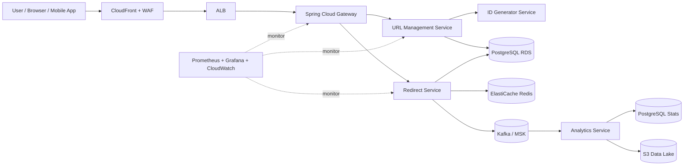
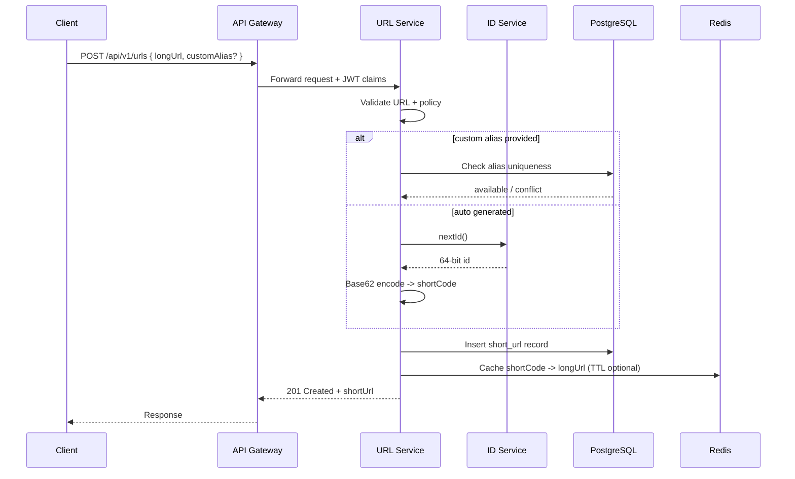
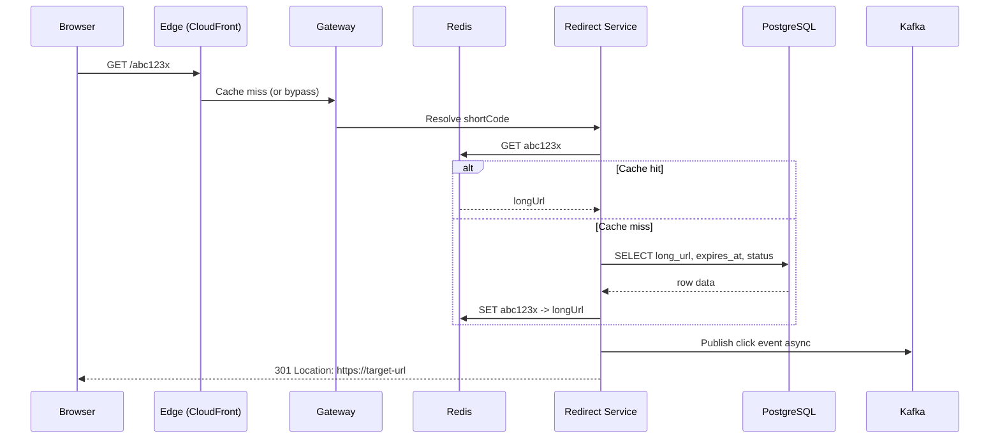
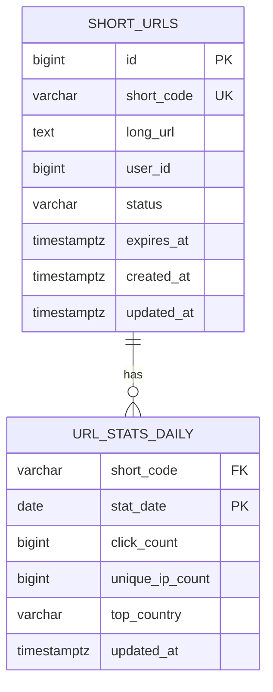
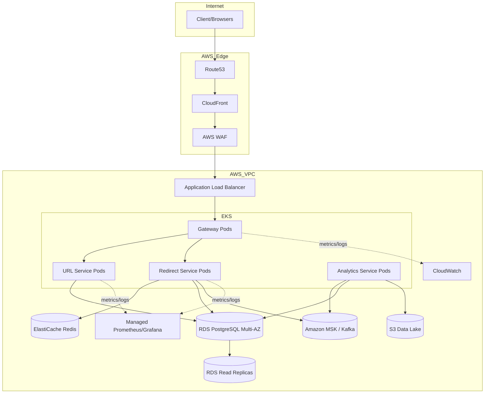

# URL Shortener (TinyURL) - System Design

## 1. 📋 Đề Bài (Problem Statement)
- Thiết kế hệ thống URL Shortener tương tự TinyURL, cho phép chuyển đổi long URL thành short URL dễ chia sẻ.
- Hệ thống phải xử lý lưu lượng đọc rất lớn (redirect), độ trễ thấp, và đảm bảo link ổn định trong thời gian dài.
- Scope chính: tạo short URL, redirect, custom alias, expiration, và analytics cơ bản.
- Scope ngoài bài (out of scope): deep malware scanning, QR generator, full marketing campaign suite.
- Mục tiêu business: tăng tốc độ chia sẻ link, tracking click, và cung cấp nền tảng cho API integrations.

## 2. 🔍 Requirement Gathering & Analysis

### 2.1 Functional Requirements
| Priority | Requirement | Mô tả |
|---|---|---|
| MUST-HAVE | Create short URL | User nhập long URL và nhận về short URL duy nhất |
| MUST-HAVE | Redirect | Khi truy cập short URL, hệ thống trả về HTTP redirect đến long URL |
| MUST-HAVE | High availability redirect | Redirect vẫn hoạt động khi một phần service lỗi |
| MUST-HAVE | URL validation | Validate format URL, block schema không hợp lệ |
| NICE-TO-HAVE | Custom alias | User chọn alias riêng (ví dụ `tiny.ly/sale2026`) |
| NICE-TO-HAVE | Expiration time | Link tự hết hạn theo thời gian |
| NICE-TO-HAVE | Basic analytics | Theo dõi số lượt click theo ngày, quốc gia, user-agent |

### 2.2 Non-Functional Requirements
- **Performance**: Redirect p95 < 50ms (cache hit), create URL p95 < 200ms.
- **Scalability**: Hỗ trợ peak ~70K redirect QPS và ~2K create QPS.
- **Availability**: SLA 99.99% cho redirect path, 99.9% cho create/manage API.
- **Consistency**: Read-after-write gần real-time cho link mới tạo (<1s), analytics chấp nhận eventual consistency.
- **Security**: JWT/OAuth2 cho API quản trị, TLS end-to-end, chống abuse/spam link.
- **Observability**: Metrics, logs, traces đầy đủ theo Golden Signals (latency, error, traffic, saturation).

### 2.3 Capacity Estimation (Back-of-the-envelope)
#### Bước 0: Quy ước đơn vị (để tránh nhầm)
- `1 day = 86,400 seconds`
- `1M = 1,000,000`, `1B = 1,000,000,000` (B ở đây là Billion, không phải Byte)
- `1 byte = 8 bits`
- Trong phần này dùng đơn vị thập phân cho dễ tính: `1KB = 1,000B`, `1GB = 1,000,000,000B`

#### Bước 1: Inputs giả định
| Input | Giá trị | Tại sao chọn |
|---|---|---|
| DAU | 100M users/day | Bài toán consumer scale lớn |
| New short URLs/day | 30M links/day | Giả sử khoảng 30% DAU tạo 1 link/ngày |
| Avg clicks per link/day | 40 clicks | Có mix link ít click và link viral |
| Avg long URL size | 300B | Kịch bản conservative (URL có query params/UTM) |
| Metadata per URL | 200B | id, short_code, status, user_id, timestamps + overhead row/index |
| Avg redirect payload | 1.5KB/click | Request + response headers và overhead mạng cơ bản |

> 📌 `300B` cho `long_url` là giả định capacity để tránh under-estimate, không phải hằng số cứng.

#### Bước 2: Tính write traffic (create short URL)
- Công thức: `write_qps_avg = new_urls_per_day / 86,400`
- Thay số: `30,000,000 / 86,400 = 347.2`
- Kết quả: **write QPS trung bình ~347**
- Peak factor giờ cao điểm chọn `x5`: `347 * 5 = 1,735`
- Kết quả: **peak write QPS ~1,735**

#### Bước 3: Tính read traffic (redirect)
- Công thức click/ngày: `daily_clicks = new_urls_per_day * avg_clicks_per_link`
- Thay số: `30,000,000 * 40 = 1,200,000,000 = 1.2B clicks/day`
- Công thức read QPS: `read_qps_avg = daily_clicks / 86,400`
- Thay số: `1,200,000,000 / 86,400 = 13,888.9`
- Kết quả: **read QPS trung bình ~13,889**
- Peak factor `x5`: `13,889 * 5 = 69,445`
- Kết quả: **peak read QPS ~69,445**

#### Bước 4: Tính storage cho bảng URL
- Kích thước 1 record: `record_size = avg_long_url + metadata`
- Thay số (kịch bản conservative): `300B + 200B = 500B/record`
- Daily raw storage: `30,000,000 * 500B = 15,000,000,000B = 15GB/day`
- Yearly raw storage: `15GB * 365 = 5,475GB ~ 5.48TB/year`
- 5-year raw storage: `5.48TB * 5 = 27.4TB`
- Cộng index + replication + free space (xấp xỉ `3x`): `~82TB` (thực tế vận hành lấy **80-90TB**)

#### Bước 5: Tính bandwidth redirect mỗi ngày
- Công thức: `redirect_bandwidth/day = daily_clicks * payload_per_click`
- Thay số: `1.2B * 1.5KB = 1.8B KB = 1.8TB/day`
- Đổi sang bit: `1.8TB * 8 = 14.4Tb/day`

#### Bước 6: Redis cache memory estimate
- Giả sử quy luật 80/20: khoảng **5% links nóng** tạo phần lớn traffic.
- Nếu active links cần phục vụ nhanh khoảng `1B`, thì hot set ~`50M links`.
- Giả sử 1 cache entry trung bình `~400B` (key + value + metadata + Redis overhead):
  - `50M * 400B = 20GB` raw
- Cộng replication + fragmentation + headroom: nhân khoảng `2x`
  - Kết quả cluster Redis nên chuẩn bị **~40GB**.

#### Bước 7: So sánh nhanh 2 kịch bản để dễ kiểm chứng
| Kịch bản | Avg long URL | Record size | Daily storage (30M links/day) |
|---|---|---|---|
| Base | 120B | 320B | 9.6GB/day |
| Conservative (đang dùng) | 300B | 500B | 15GB/day |

## 3. ⚖️ Trade-offs
### 3.1 Bảng tổng quan quyết định
| Decision | Option A | Option B | Chọn | Lý do chính |
|---|---|---|---|---|
| ID generation | Random hash + collision check | **Snowflake ID + Base62** | B | Không cần collision check runtime, latency ổn định khi write tăng |
| Redirect type | 302 (temporary) | **301 (permanent)** | B | Cache tốt ở browser/CDN, giảm request quay về origin |
| Data store chính | **PostgreSQL** | Cassandra | A | Cần unique constraints + query quản trị linh hoạt |
| Cache strategy | **Cache-aside Redis** | Write-through | A | Phù hợp workload read-heavy, giảm write amplification |
| Analytics pipeline | PostgreSQL sync write | **Kafka async events** | B | Tách redirect critical path, giữ redirect latency thấp |

### 3.2 Decision #1: ID Generation (Random Hash vs Snowflake + Base62)
| Tiêu chí | Random hash + collision check | Snowflake + Base62 |
|---|---|---|
| Uniqueness | Probabilistic, cần check DB | Deterministic unique theo node+timestamp+sequence |
| Write latency | Có thể tăng khi phải retry collision | Ổn định hơn, không cần retry collision |
| Độ dài short code | Dễ ép cố định 7-8 chars | Encode full ID thường 10-11 chars |
| Độ phức tạp vận hành | Đơn giản lúc đầu | Cần đồng bộ clock và worker ID |

#### Cách 1: Random Hash + Collision Check hoạt động thế nào?
1. Nhận `long_url`.
2. Tạo seed: `long_url + "|" + nonce + "|" + timestamp`.
3. Băm SHA-256(seed).
4. Convert hash sang Base62, lấy 7 ký tự đầu làm `short_code`.
5. Check DB: nếu trùng thì tăng `nonce` và lặp lại.

**Ví dụ từng bước**:
1. `long_url = https://shop.example.com/deal?utm_campaign=sale&utm_source=facebook`
2. `timestamp = 2026-02-28T10:00:00Z`
3. Lần 1 với `nonce = 0`:
   - seed = `https://shop.example.com/deal?utm_campaign=sale&utm_source=facebook|0|2026-02-28T10:00:00Z`
   - SHA-256 = `3ca09f253d8275c124936e3e10b15adbcd9814fa052f634ac137acb197e78695`
   - Base62 prefix = `ENLlbnZS63VeqvoOVZOs...`
   - Lấy 7 ký tự => `ENLlbnZ`
   - DB báo đã tồn tại -> collision
4. Lần 2 với `nonce = 1`:
   - SHA-256 = `649ec9a6d40b40074cfc18510f1283b1c8786c08cb9dac134059f70e9e0901c9`
   - Base62 prefix = `NrKT6qWPGVl61KeWEjYq...`
   - Lấy 7 ký tự => `NrKT6qW`
   - DB chưa có -> insert thành công

- **Điểm mạnh**: đơn giản, không cần service ID riêng.
- **Điểm yếu**: ở peak traffic có thể gặp retry, làm latency dao động; luôn cần check DB uniqueness.

#### Cách 2: Snowflake ID + Base62 hoạt động thế nào?
**Cấu trúc Snowflake điển hình (64-bit)**:
- `41 bits timestamp` (ms từ custom epoch)
- `10 bits workerId` (mã node sinh ID)
- `12 bits sequence` (counter trong cùng 1 ms)

**`workerId` và `sequence` là gì?**
- `workerId = 17`: node/pod số 17 trong cụm ID generator.
- `sequence = 23`: ID thứ 23 được node đó phát ra trong cùng millisecond hiện tại.

**Luồng xử lý**:
1. `id_generator_service` tự quản lý `sequence` và sinh `snowflake_id`.
2. URL service encode `snowflake_id` sang Base62.
3. Insert DB một lần (UNIQUE index chỉ là safety net).

**Flow end-to-end cụ thể (với số thật)**:
1. Cấu hình:
   - `epoch = 2024-01-01T00:00:00Z`
   - `workerId = 17`
   - Generator state ban đầu: `lastTimestamp = null`, `sequence = 0`
2. Request A đến lúc `2026-02-28T10:00:00.123Z`:
   - `delta_ms = 68,205,600,123`
   - Vì là ms mới -> `sequence = 0`
   - `snowflake_id = (delta_ms << 22) | (17 << 12) | 0`
   - `snowflake_id = 286075021418369024`
   - Base62 -> `L8E3B1JoxM`
   - Insert DB:
     - `id = 286075021418369024`
     - `short_code = L8E3B1JoxM`
     - `long_url = ...`
3. Request B vẫn trong cùng ms `.123`:
   - `timestamp` không đổi -> tăng `sequence = 1`
   - `snowflake_id = 286075021418369025`
   - Base62 -> `L8E3B1JoxN`
   - Insert DB 1 lần thành công
4. Request C vẫn trong cùng ms `.123`:
   - `sequence = 2`
   - `snowflake_id = 286075021418369026`
   - Base62 -> `L8E3B1JoxO`
5. Nếu cùng ms mà sequence chạm trần:
   - Với 12 bits, max sequence = `4095`
   - ID cuối trong ms `.123`: `286075021418373119` -> `L8E3B1Jq1P`
   - Request tiếp theo phải đợi sang ms `.124`, reset `sequence = 0`
   - ID mới: `286075021422563328` -> `L8E3B1bQ5Q`
6. Tại sao chỉ insert DB 1 lần:
   - ID đã unique theo `timestamp + workerId + sequence`, nên không cần vòng lặp retry như random-hash.
   - `UNIQUE(short_code)` vẫn giữ để làm safety net nếu có misconfiguration hiếm (trùng workerId, clock lỗi).

**Chi tiết bước 2: URL service encode Snowflake ID sang Base62**
- Bảng ký tự Base62: `0123456789ABCDEFGHIJKLMNOPQRSTUVWXYZabcdefghijklmnopqrstuvwxyz`
- Nguyên tắc:
  1. Lấy `id` chia cho `62`.
  2. Lấy `remainder` (0..61) map sang 1 ký tự.
  3. Lấy `quotient` chia tiếp cho `62` đến khi bằng `0`.
  4. Ghép các ký tự theo thứ tự ngược lại.

Ví dụ với `id = 286075021418369024`:

| Vòng | n hiện tại | q = n / 62 | r = n % 62 | Ký tự |
|---|---:|---:|---:|---|
| 1 | 286075021418369024 | 4614113248683371 | 22 | `M` |
| 2 | 4614113248683371 | 74421181430376 | 59 | `x` |
| 3 | 74421181430376 | 1200341635973 | 50 | `o` |
| 4 | 1200341635973 | 19360348967 | 19 | `J` |
| 5 | 19360348967 | 312263693 | 1 | `1` |
| 6 | 312263693 | 5036511 | 11 | `B` |
| 7 | 5036511 | 81234 | 3 | `3` |
| 8 | 81234 | 1310 | 14 | `E` |
| 9 | 1310 | 21 | 8 | `8` |
| 10 | 21 | 0 | 21 | `L` |

- Ký tự thu được theo thứ tự vòng lặp: `M x o J 1 B 3 E 8 L`
- Đảo ngược lại: **`L8E3B1JoxM`**

**Vì sao Snowflake gần như không trùng?**
- `workerId` phải unique giữa các node.
- Trên mỗi node, `sequence` tăng dần trong cùng ms; sang ms mới thì reset.
- Nếu `sequence` tràn (hơn 4096 ID/ms), generator chờ sang ms tiếp theo.
- Clock phải được đồng bộ (NTP); nếu clock lùi thì generator tạm dừng hoặc failover.

- **Điểm mạnh**: không collision runtime (nếu clock/worker đúng), latency ổn định hơn.
- **Điểm yếu**: cần quản lý clock drift, worker ID, và sequence overflow.

#### Pseudo-code so sánh nhanh
```text
Random Hash:
do:
  code = base62(sha256(longUrl + nonce + now))[0..6]
while exists(code)
insert(code, longUrl)

Snowflake + Base62:
id = snowflake.nextId()
code = base62(id)
insert(code, longUrl)  // unique index as safety net
```

#### Kết luận cho bài toán này
- **Context**: write peak ~1.7K QPS, cần latency create ổn định.
- **Chọn Snowflake + Base62** vì giảm retry loop và giảm query-check collision trên critical path.
- **Lưu ý độ dài**: nếu encode full Snowflake thì code thường 10-11 ký tự; nếu bắt buộc 7-8 ký tự thì cần chiến lược khác (ví dụ random/truncate + collision check).
- **Mitigation vận hành**:
  - NTP đồng bộ clock cho các node ID generator.
  - Fallback nếu clock lùi: tạm dừng phát ID vài ms hoặc switch node khác.
  - Có thể thêm obfuscation (salt/permutation) trước khi trả code ra ngoài để giảm khả năng đoán chuỗi.

### 3.3 Decision #2: Redirect Semantics (301 vs 302)
| Tiêu chí | 302 Temporary | 301 Permanent |
|---|---|---|
| Cache browser/CDN | Thấp hơn | Cao hơn |
| Latency trung bình | Cao hơn do quay lại origin nhiều hơn | Thấp hơn cho traffic lặp |
| Khả năng đổi target URL | Linh hoạt hơn | Kém linh hoạt hơn (client cache lâu) |
| SEO | Trung tính | Tốt hơn cho canonical redirect |

#### Context kỹ thuật
- Redirect là hot path (~70K QPS peak), mục tiêu chính là giảm round-trip về origin.
- Mỗi request redirect đi qua nhiều tầng (CloudFront -> Gateway -> Redirect Service -> Redis/DB), nên tối ưu cache ở edge mang lại lợi ích lớn nhất.
- Link short trong sản phẩm mặc định xem như immutable sau khi publish.

#### Cách 301 và 302 khác nhau trong thực tế
| Tình huống | Nếu dùng 302 | Nếu dùng 301 |
|---|---|---|
| User click lần 1 | Trình duyệt vẫn phải hỏi origin | Trình duyệt nhận redirect và có thể cache |
| User click lần 2 cùng link | Thường vẫn gọi lại origin | Nhiều trường hợp dùng cache local/edge, giảm call origin |
| Link viral (hàng triệu click lặp) | Origin chịu tải cao hơn | Giảm đáng kể origin QPS |
| Owner đổi target URL | Dễ cập nhật ngay | Khó hơn do client/CDN có thể cache lâu |

#### Ví dụ end-to-end cụ thể
1. Giả sử một short link được click `10M` lần/ngày, trong đó `60%` là revisit từ user/client đã từng click.
2. Nếu dùng `302`, phần lớn `10M` request vẫn quay về origin để lấy redirect.
3. Nếu dùng `301` + `Cache-Control: public, max-age=86400`, phần revisit có thể được phục vụ từ browser/CDN.
4. Giả sử cache absorb được 40% traffic revisit, origin giảm khoảng:
   - `10M * 60% * 40% = 2.4M requests/day`
5. Kết quả: giảm chi phí hạ tầng và hạ p95 latency trên đường redirect.

#### Rủi ro khi dùng 301 và cách giảm rủi ro
- **Rủi ro 1: đổi target URL khó propagate**.
  - Mitigation: policy “immutable by default”; nếu cần đổi, tạo short code mới.
- **Rủi ro 2: link bị abuse nhưng đã cache**.
  - Mitigation: trả `410 Gone`, set `Cache-Control: no-store` cho response lỗi, trigger CDN invalidation cho key nóng.
- **Rủi ro 3: cache quá lâu gây stale behavior**.
  - Mitigation: chỉ dùng TTL lớn cho active link ổn định; link editable dùng 302 và TTL ngắn.

#### Rule vận hành đề xuất
- Mặc định: public short link dùng `301`.
- Link cần chỉnh sửa thường xuyên (A/B campaign, thử nghiệm): dùng `302`.
- Khi có security incident: ưu tiên disable link và trả `410` ngay.

### 3.4 Decision #3: Primary Data Store (PostgreSQL vs Cassandra)
| Tiêu chí | PostgreSQL | Cassandra |
|---|---|---|
| Unique alias constraints | Mạnh (UNIQUE index) | Phức tạp hơn (cần design riêng) |
| Transaction support | ACID tốt | Eventual consistency mặc định |
| Query quản trị | Mạnh (filter/sort/report) | Tối ưu theo access pattern cố định |
| Scale write cực lớn | Scale vertical + partition/read replica | Scale ngang rất tốt |

#### Access patterns cần support
1. `GET /{shortCode}`: lookup theo `short_code` (cực nhiều).
2. `POST /api/v1/urls`: insert mới + kiểm tra unique alias.
3. `GET /api/v1/urls?cursor=...`: list URL theo `user_id`, sort theo `created_at`.
4. `DELETE /api/v1/urls/{shortCode}`: update status/soft-delete.
5. `GET stats`: đọc aggregate theo `(short_code, date)`.

#### Vì sao chọn PostgreSQL cho v1
- Cần `UNIQUE(short_code)` và `UNIQUE(custom_alias)` đảm bảo chính xác ngay khi ghi.
- Cần transaction rõ ràng cho luồng create + ownership + audit.
- Cần query quản trị linh hoạt (lọc theo user, trạng thái, khoảng thời gian).
- Ở quy mô trong capacity hiện tại (write ~347 avg, ~1.7K peak), PostgreSQL + partition + replica vẫn rất phù hợp.

#### Flow ghi/đọc điển hình với PostgreSQL
1. Create link:
   - Validate URL.
   - Sinh `short_code`.
   - `INSERT` vào `short_urls`.
   - Nếu trùng unique -> `409 Conflict`.
2. Redirect:
   - Đọc Redis trước.
   - Miss thì `SELECT long_url, status, expires_at FROM short_urls WHERE short_code=?`.
3. Disable link:
   - `UPDATE short_urls SET status='DISABLED', updated_at=NOW() WHERE short_code=? AND user_id=?`.

#### Ví dụ SQL cho tính nhất quán alias
```sql
INSERT INTO short_urls (id, short_code, long_url, user_id, status)
VALUES (:id, :short_code, :long_url, :user_id, 'ACTIVE');
-- Nếu short_code đã tồn tại, PostgreSQL ném unique violation ngay.
```

#### Điểm yếu của PostgreSQL và kế hoạch giảm rủi ro
- **Điểm yếu**: scale write ngang kém hơn Cassandra ở workload cực lớn.
- **Mitigation 1**: hash partition bảng `short_urls` theo `short_code`.
- **Mitigation 2**: read replicas cho query dashboard/stats.
- **Mitigation 3**: giữ redirect chủ yếu ở Redis để giảm DB load.
- **Mitigation 4**: tách analytics raw ra Kafka + S3 thay vì dồn vào PostgreSQL.

#### Khi nào nên cân nhắc Cassandra
| Dấu hiệu | Ý nghĩa |
|---|---|
| Write QPS tăng lên mức rất cao và kéo dài | RDS bắt đầu là bottleneck ghi |
| Dữ liệu phân tán đa region active-active mạnh | Cassandra replication model có lợi hơn |
| Access pattern đơn giản dạng key-value khối lượng cực lớn | Cassandra phù hợp hơn relational query |

> 💡 **Tại sao chưa dùng Cassandra ngay từ đầu?**
> Với bài toán TinyURL v1, nhu cầu uniqueness + quản trị + transaction quan trọng hơn lợi ích scale write cực lớn. Chọn PostgreSQL giúp giảm độ phức tạp triển khai ban đầu.

### 3.5 Decision #4: Cache Strategy (Cache-aside vs Write-through)
| Tiêu chí | Cache-aside | Write-through |
|---|---|---|
| Độ phức tạp | Đơn giản, app kiểm soát cache | Logic ghi đồng thời DB + cache |
| Cache miss đầu tiên | Có penalty | Ít hơn |
| Write cost | Thấp hơn | Cao hơn (mọi write đi qua cache) |
| Phù hợp read-heavy | Tốt | Trung bình |

#### Context kỹ thuật
- Redirect là read-heavy cực cao; create/update comparatively thấp.
- Mục tiêu: p95 redirect thấp, kể cả khi DB đang có spike.

#### Flow cache-aside chi tiết
1. `GET /{shortCode}` vào redirect-service.
2. Service gọi Redis:
   - **Hit**: trả redirect ngay (không chạm DB).
   - **Miss**: đọc PostgreSQL -> validate status/expiry -> set Redis -> trả redirect.
3. Link bị disable/expire:
   - Update DB trước (source of truth).
   - Xóa/invalidate cache key tương ứng.

#### Ví dụ định lượng lợi ích
Giả sử:
- Redis hit latency: `~2ms`
- PostgreSQL lookup latency: `~25ms`
- Cache hit ratio: `90%`

Latency trung bình xấp xỉ:
- `0.9 * 2 + 0.1 * 25 = 4.3ms` (chưa tính network)

Nếu không cache:
- Gần như toàn bộ request phải đi DB -> khoảng `~25ms` baseline hoặc hơn khi load tăng.

#### Vì sao không chọn write-through làm mặc định
- Write-through bắt mọi lần ghi phải update cache ngay, tăng độ phức tạp và write amplification.
- Với URL shortener, write ít hơn read rất nhiều; lợi ích write-through không bù được chi phí vận hành.
- Cache-aside cho phép chỉ cache những key thật sự được đọc (hot keys).

#### Failure scenarios và mitigation
- **Cache stampede khi hot key vừa hết TTL**:
  - Dùng request coalescing/single-flight.
  - Thêm TTL jitter ngẫu nhiên.
- **Stale cache sau khi disable link**:
  - Event invalidation tức thì + TTL ngắn cho key nhạy cảm.
- **Redis outage**:
  - Fallback DB, bật circuit breaker và rate-limit để bảo vệ DB.
- **Hot key skew**:
  - Local L1 cache ngắn hạn + Redis cluster sharding.

### 3.6 Decision #5: Analytics Ingestion (Sync write DB vs Kafka async)
| Tiêu chí | Ghi sync vào PostgreSQL | Kafka async events |
|---|---|---|
| Redirect latency | Tăng theo DB write | Thấp hơn, tách khỏi critical path |
| Độ bền dữ liệu click | Cao nhưng đắt | Cao nếu cấu hình durability đúng |
| Khả năng scale analytics | Hạn chế | Rất tốt, consumer scale ngang |
| Độ phức tạp | Đơn giản ban đầu | Cao hơn (queue + consumers + retry) |

#### Context kỹ thuật
- Click volume ước tính `1.2B events/day` (~13.9K EPS trung bình, peak cao hơn nhiều).
- Nếu mỗi click ghi sync vào DB trên redirect path, latency và DB cost tăng mạnh.

#### So sánh trực tiếp 2 cách
| Tiêu chí vận hành | Sync DB write | Kafka async |
|---|---|---|
| Redirect p95 | Dễ tăng theo DB contention | Ổn định hơn vì tách luồng |
| Khả năng buffer burst traffic | Thấp | Cao (Kafka làm buffer) |
| Khả năng replay dữ liệu | Khó | Dễ (re-consume theo offset) |
| Phức tạp hệ thống | Thấp | Trung bình-cao |

#### Flow Kafka async chi tiết
1. Redirect service resolve short code và trả `301` cho client trước.
2. Cùng lúc publish `ClickEvent` vào Kafka topic `url-click-events`.
3. Analytics consumer đọc event theo partition.
4. Consumer aggregate theo `(short_code, stat_date)` và upsert vào `url_stats_daily`.
5. Raw events đồng thời đẩy sang S3 để phân tích sâu/offline.
6. Dashboard đọc từ bảng aggregate, không đọc trực tiếp raw stream.

#### Ví dụ event schema
```json
{
  "eventId": "9f3e2f59-2b8b-4f0a-9d0b-78f1f2f76e11",
  "shortCode": "L8E3B1JoxM",
  "clickedAt": "2026-02-28T10:00:00.123Z",
  "ipHash": "e4bc1a...",
  "userAgent": "Mozilla/5.0",
  "country": "US",
  "referrer": "https://example.com"
}
```

#### Duplicate và consistency xử lý thế nào
- Thực tế thường dùng **at-least-once** delivery, nên duplicate có thể xảy ra.
- Cách xử lý:
  - Producer bật idempotence.
  - Consumer upsert theo key `(short_code, stat_date)`.
  - Optional dedupe theo `eventId` trong cửa sổ thời gian ngắn.
- Kết quả: analytics mang tính eventual consistency (trễ vài giây/phút) nhưng redirect path vẫn nhanh.

#### Failure scenarios và mitigation
- **Kafka lag tăng cao**:
  - Auto-scale consumers theo lag.
  - Alert khi lag vượt ngưỡng.
- **Consumer crash giữa chừng**:
  - Commit offset sau khi ghi DB thành công.
- **DB aggregate bị nghẽn**:
  - Batch upsert, tune indexes, partition theo ngày.
- **Poison message**:
  - Dead-letter topic + replay tool.

#### SLA tách biệt
- Redirect SLA: realtime, ưu tiên latency thấp và availability cao.
- Analytics SLA: cho phép trễ `1-5 phút` để đổi lấy khả năng scale và ổn định.

## 4. 🧩 Defining Entities / Components


| Component | Vai trò |
|---|---|
| CloudFront + WAF | Edge caching, DDoS/basic bot protection, giảm latency toàn cầu |
| Spring Cloud Gateway | API routing, auth filter, rate limiting |
| URL Management Service | Create/update/delete URL, custom alias validation |
| Redirect Service | Resolve short code và trả redirect response cực nhanh |
| Redis | Cache mapping `short_code -> long_url` cho hot traffic |
| PostgreSQL | Source of truth cho URL metadata, ownership, expiration |
| Kafka + Analytics Service | Thu click events async, aggregate số liệu |

## 5. 🔗 Client-Server Connection
- **Protocol**:
  - Management APIs: HTTPS REST/JSON (`/api/v1/...`).
  - Redirect: HTTP GET `/{shortCode}` trả về `301 Location`.
- **Authentication**:
  - Anonymous được phép redirect.
  - JWT Bearer token bắt buộc cho create/delete/stats owner-level.
- **Connection patterns**:
  - Request-Response cho create/manage.
  - Async Pub-Sub qua Kafka cho click analytics.
- **Rate limiting & throttling**:
  - Anonymous create API: 30 req/min/IP.
  - Authenticated users: theo plan (Free/Pro/Enterprise).
  - Dùng Redis token bucket ở Gateway.
- **Idempotency**:
  - Hỗ trợ `Idempotency-Key` cho `POST /api/v1/urls` để tránh tạo trùng khi retry.

## 6. 🔄 System / App Flow
### Flow 1: Tạo short URL


### Flow 2: Redirect short URL


### Error handling & Edge cases
- Short code không tồn tại: trả `404` với landing page thân thiện (không expose internals).
- Link hết hạn hoặc bị disable: trả `410 Gone`.
- Malformed URL khi tạo: trả `400 Bad Request`.
- Alias đã tồn tại: trả `409 Conflict`.
- Redis outage: fallback đọc PostgreSQL, degrade nhẹ nhưng vẫn redirect được.

## 7. 📡 API Modeling
### Endpoint Definitions
| Method | Path | Auth | Mô tả |
|---|---|---|---|
| POST | `/api/v1/urls` | JWT optional (required để quản lý ownership) | Tạo short URL |
| GET | `/{shortCode}` | None | Redirect đến long URL |
| GET | `/api/v1/urls/{shortCode}` | JWT owner/admin | Lấy metadata URL |
| GET | `/api/v1/urls/{shortCode}/stats?from=...&to=...` | JWT owner/admin | Lấy analytics |
| DELETE | `/api/v1/urls/{shortCode}` | JWT owner/admin | Disable URL |
| GET | `/api/v1/urls?cursor=...&limit=20` | JWT | Danh sách URL của user |

### Request/Response Examples
```http
POST /api/v1/urls
Content-Type: application/json
Idempotency-Key: 3f8f5e18-1fd3-4d16-8fdb-8bd1519e41d5
Authorization: Bearer <token>

{
  "longUrl": "https://example.com/products/spring-boot-url-shortener-guide",
  "customAlias": "spring-guide-2026",
  "expireAt": "2026-12-31T23:59:59Z"
}
```

```json
{
  "id": "01J7W6FQ3PR8M1H9B2Y7TZ0Y4D",
  "shortCode": "spring-guide-2026",
  "shortUrl": "https://tiny.example.com/spring-guide-2026",
  "longUrl": "https://example.com/products/spring-boot-url-shortener-guide",
  "createdAt": "2026-02-28T10:00:00Z",
  "expireAt": "2026-12-31T23:59:59Z"
}
```

```http
GET /abc123x
```

```http
HTTP/1.1 301 Moved Permanently
Location: https://example.com/products/spring-boot-url-shortener-guide
Cache-Control: public, max-age=86400
```

### Error Response Format
```json
{
  "timestamp": "2026-02-28T10:01:22Z",
  "status": 409,
  "error": "Conflict",
  "code": "ALIAS_ALREADY_EXISTS",
  "message": "Custom alias is already taken",
  "path": "/api/v1/urls"
}
```

### Pagination / Filtering / Sorting
- Dùng cursor-based pagination cho endpoint list URL để tránh offset scan nặng.
- Cho phép filter theo `status`, `createdFrom`, `createdTo`.
- Sort mặc định `created_at DESC`.

### API Versioning
- Version qua path `/api/v1`.
- Breaking changes phát hành `/api/v2`, duy trì dual-run tối thiểu 6 tháng.

## 8. 🗄️ Data Modeling
### Database Schema (PostgreSQL)
```sql
CREATE TABLE short_urls (
    id BIGINT PRIMARY KEY,
    short_code VARCHAR(16) NOT NULL UNIQUE,
    long_url TEXT NOT NULL,
    user_id BIGINT NULL,
    status VARCHAR(20) NOT NULL DEFAULT 'ACTIVE',
    expires_at TIMESTAMPTZ NULL,
    created_at TIMESTAMPTZ NOT NULL DEFAULT NOW(),
    updated_at TIMESTAMPTZ NOT NULL DEFAULT NOW(),
    CONSTRAINT chk_status CHECK (status IN ('ACTIVE', 'DISABLED', 'EXPIRED'))
);

CREATE TABLE url_stats_daily (
    short_code VARCHAR(16) NOT NULL,
    stat_date DATE NOT NULL,
    click_count BIGINT NOT NULL DEFAULT 0,
    unique_ip_count BIGINT NOT NULL DEFAULT 0,
    top_country VARCHAR(2) NULL,
    updated_at TIMESTAMPTZ NOT NULL DEFAULT NOW(),
    PRIMARY KEY (short_code, stat_date)
);
```

### ER Diagram


### Indexing Strategy
- `UNIQUE INDEX idx_short_urls_short_code` cho lookup redirect.
- `INDEX idx_short_urls_user_created` trên `(user_id, created_at DESC)` cho dashboard user.
- `PARTIAL INDEX idx_short_urls_active` trên `status='ACTIVE'` để giảm scan.
- `INDEX idx_url_stats_daily_date` trên `(stat_date)` cho báo cáo theo ngày.

### Partitioning / Sharding Strategy
- `short_urls`: hash partition theo `short_code` (32 partitions) để phân tán I/O.
- `url_stats_daily`: range partition theo `stat_date` theo tháng.
- Nếu vượt ngưỡng single-region RDS, shard theo prefix `short_code` (application-level routing).

### Data Retention Policy
- `short_urls`: giữ lâu dài (trừ khi user yêu cầu xóa theo compliance).
- `url_stats_daily`: giữ chi tiết 24 tháng, sau đó rollup monthly.
- Raw click events trong S3 lifecycle về Glacier sau 90 ngày.

> 💡 **Tại sao không lưu toàn bộ click events vào PostgreSQL?**
> Redirect có QPS rất cao; ghi synchronous vào PostgreSQL sẽ tăng latency và chi phí write. Dùng Kafka + S3 data lake cho raw events giúp tách critical path và scale analytics tốt hơn.

## 9. ⚙️ Manager Classes / Services
### Service Decomposition (Spring Boot microservices)
- `gateway-service`: auth, rate limiting, request routing.
- `url-service`: tạo link, validate, ownership checks, metadata CRUD.
- `redirect-service`: resolve short code, cache fallback DB, emit click event.
- `analytics-service`: consume Kafka events, aggregate `url_stats_daily`.
- `id-generator-service`: sinh Snowflake IDs đồng nhất toàn cụm.

### Core Service Classes & Responsibilities
- `ShortUrlService` (`@Service`): business logic create/disable URL.
- `RedirectResolver` (`@Component`): resolve + expiration/status checks.
- `ClickEventPublisher` (`@Component`): publish analytics events tới Kafka.
- `SecurityConfig` (`@Configuration`): Spring Security + JWT validation.
- `AuditLoggingAspect` (`@Aspect`): log structured audit cho actions quan trọng.

### Backend Code Example (Java / Spring Boot)
```java
@Service
public class ShortUrlService {

    private final ShortUrlRepository shortUrlRepository;
    private final IdGeneratorClient idGeneratorClient;

    public ShortUrlService(ShortUrlRepository shortUrlRepository,
                           IdGeneratorClient idGeneratorClient) {
        this.shortUrlRepository = shortUrlRepository;
        this.idGeneratorClient = idGeneratorClient;
    }

    @Transactional
    public ShortUrlResponse create(CreateShortUrlRequest req, Long userId) {
        String shortCode = req.customAlias() != null
                ? req.customAlias()
                : Base62.encode(idGeneratorClient.nextId());

        if (shortUrlRepository.existsByShortCode(shortCode)) {
            throw new ConflictException("ALIAS_ALREADY_EXISTS");
        }

        ShortUrlEntity entity = ShortUrlEntity.of(shortCode, req.longUrl(), userId, req.expireAt());
        shortUrlRepository.save(entity);
        return ShortUrlResponse.from(entity);
    }
}
```

### Frontend Code Example (React + TypeScript)
```tsx
import { useState } from "react";

export function CreateUrlForm() {
  const [longUrl, setLongUrl] = useState("");
  const [shortUrl, setShortUrl] = useState("");

  async function onSubmit(e: React.FormEvent) {
    e.preventDefault();
    const res = await fetch("/api/v1/urls", {
      method: "POST",
      headers: { "Content-Type": "application/json" },
      body: JSON.stringify({ longUrl }),
    });
    const data = await res.json();
    setShortUrl(data.shortUrl);
  }

  return (
    <form onSubmit={onSubmit}>
      <input value={longUrl} onChange={(e) => setLongUrl(e.target.value)} placeholder="Paste long URL" />
      <button type="submit">Shorten</button>
      {shortUrl && <p>{shortUrl}</p>}
    </form>
  );
}
```

### Service Communication Patterns
- Sync REST: Gateway -> URL/Redirect services qua internal HTTP (WebClient).
- Async event: Redirect service -> Kafka -> Analytics service.
- Shared libs: common error model, tracing interceptor, auth principal extractor.

## 10. 🏛️ Architecture Design
- Pattern chính: **Microservices + Event-driven analytics**.
- Redirect path tối ưu read latency: CloudFront -> Gateway -> Redis -> PostgreSQL fallback.
- Deployment trên **AWS EKS** multi-AZ, tách node group cho redirect workload.
- RDS PostgreSQL Multi-AZ + read replicas cho traffic đọc metadata.
- ElastiCache Redis cluster mode enabled để scale ngang.



### Scaling Strategy
- HPA theo CPU + custom metric (`redirect_rps`) cho `redirect-service`.
- VPA cho `analytics-service` (batch workload biến động).
- PostgreSQL scale-up định kỳ + read replica scale-out cho dashboard APIs.
- Redis shard rebalancing khi memory >70%.

### Caching Strategy
- L1: CloudFront cache cho popular short links.
- L2: Redis cache-aside tại redirect-service.
- Eviction policy Redis: `allkeys-lru`, TTL dynamic theo popularity.

### Load Balancing / Gateway / Mesh
- ALB route vào EKS ingress controller.
- Spring Cloud Gateway xử lý auth/rate-limit.
- Service mesh (Istio hoặc Linkerd) optional cho mTLS và traffic policy nội bộ.

## 11. 🧪 Testing Strategy
- **Unit Testing**: JUnit 5 + Mockito cho service logic, coverage target >80%.
- **Integration Testing**: Spring Boot Test + Testcontainers (PostgreSQL, Redis, Kafka).
- **API Contract Testing**: Spring Cloud Contract giữa gateway và downstream services.
- **Load Testing**: Gatling kịch bản 70K redirect QPS peak, xác nhận p95 < 50ms (cache hit).
- **Chaos Engineering**: AWS Fault Injection Simulator để test Redis node failure, AZ outage.
- **E2E Testing**: Playwright cho web UI tạo link + validate redirect behavior.

## 12. 🔒 Security
- Authentication: OAuth2/JWT cho management APIs, anonymous only cho redirect endpoint.
- Authorization: owner-based access control cho metadata/stats/delete.
- TLS everywhere: HTTPS public, mTLS nội bộ (nếu bật service mesh).
- Input validation: chặn SSRF patterns, chặn private CIDR targets nếu policy yêu cầu.
- DDoS/bot protection: WAF rate rules + AWS Shield Standard.
- Data protection: encryption at rest (RDS/Redis/S3 KMS), encryption in transit.
- OWASP Top 10: chống injection, broken auth, security misconfiguration qua secure defaults và SAST/DAST.

## 13. 📊 Monitoring & Logging
### Key Metrics
| Nhóm | Metrics |
|---|---|
| Latency | p50/p95/p99 redirect latency, create latency |
| Traffic | requests per second, redirects per short code |
| Errors | 4xx/5xx rate, DB timeout rate, cache miss ratio |
| Saturation | CPU/memory pods, Redis memory%, DB connections |

### Logging Strategy
- Structured JSON logs với `traceId`, `shortCode`, `userId`, `statusCode`.
- Log level: INFO cho business events, WARN cho retry, ERROR cho failures.
- Centralized logging qua ELK/OpenSearch, retention theo compliance.

### Alerting & Incident Response
- Alert nếu `redirect p95 > 100ms` trong 5 phút.
- Alert nếu `5xx > 1%` hoặc `cache hit ratio < 80%`.
- Runbook: detect -> triage -> mitigate -> postmortem trong 24h.
- Distributed tracing bằng OpenTelemetry + Jaeger/X-Ray.

## 14. 🔧 Maintenance
- CI/CD: GitHub Actions pipeline `build -> test -> security scan -> deploy`.
- Database migration: Flyway versioned migrations, backward-compatible trước.
- Dependency/security maintenance: Renovate + SCA scan định kỳ.
- Feature flags: LaunchDarkly (hoặc config service) cho rollout custom alias/analytics.
- Documentation: OpenAPI/Swagger auto-publish, cập nhật decision records (ADR).
- Technical debt review: sprint cuối tháng dành 10-15% capacity xử lý debt.

## 15. 🚀 Deployment Plans
- Deployment strategy: Canary (5% -> 25% -> 100%) cho redirect-service, blue-green cho gateway.
- Rollback plan: `kubectl rollout undo`, rollback Flyway theo migration policy, disable feature flags.
- IaC: Terraform modules cho VPC, EKS, RDS, ElastiCache, MSK, S3, IAM.
- Auto-scaling: HPA/VPA + cluster autoscaler + ASG cho worker nodes.
- Multi-region: active-passive (primary + DR), Route53 health-check failover.
- Artifacts: Docker multi-stage build cho Spring Boot, Helm charts cho từng service.
- Pre-prod gate: bắt buộc qua load test + smoke test trước production rollout.

## 16. ⏱️ Effort Estimation
### Phase Breakdown & Timeline
| Phase | Duration | Deliverables |
|---|---|---|
| Discovery & Requirements | 1 tuần | Scope, SLA, API contract draft |
| Core URL + Redirect MVP | 2 tuần | Create/redirect APIs, PostgreSQL + Redis |
| Analytics + Observability | 1.5 tuần | Kafka pipeline, dashboards, alerts |
| Security + Hardening | 1 tuần | AuthZ, WAF rules, abuse protections |
| Performance + Production Readiness | 1.5 tuần | Load test, chaos test, runbooks |
| Total | ~7 tuần | Production v1 |

### Team Composition
- 1 Tech Lead (architecture, trade-offs, review).
- 2 Backend Engineers (URL/redirect/analytics services).
- 1 Frontend Engineer (dashboard + URL management UI).
- 1 DevOps Engineer (EKS/Terraform/CI-CD/monitoring).
- 1 QA Engineer (test automation + performance validation).

### Risk Assessment
| Risk | Impact | Mitigation |
|---|---|---|
| Cache stampede khi hot link viral | Tăng latency đột biến | request coalescing + short TTL jitter |
| Abuse/spam links | Reputation risk | domain blocklist + rate limits + moderation queue |
| DB hotspot trên short_code | Throughput giảm | hash partition + read replicas + cache tuning |
| Analytics lag khi Kafka backlog | Stats trễ | autoscale consumers + lag alert + replay tooling |

### Dependencies & Blockers
- Cần IAM/security baseline từ platform team trước khi lên production.
- Cần domain + TLS certificate + WAF policy approved.
- Cần budget approval cho MSK và cross-region DR.
